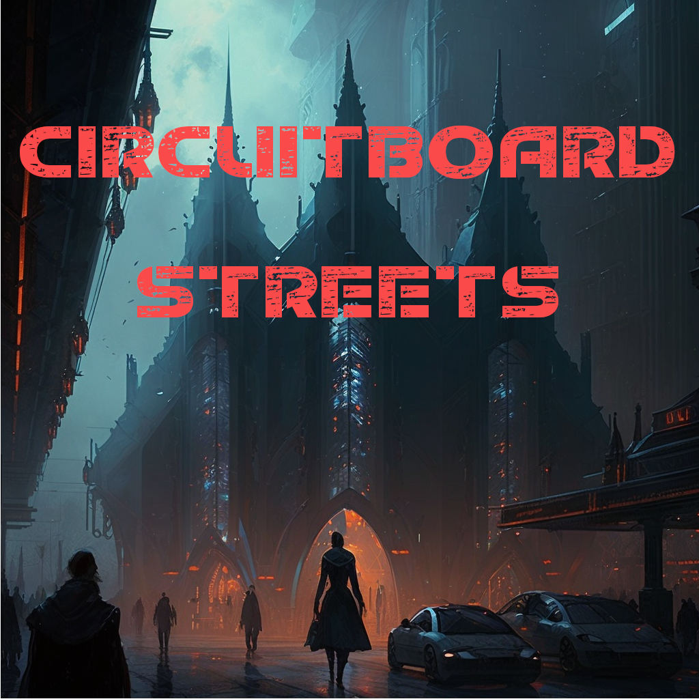

# Circuitboard Streets

## An interactive cyberpunk novel

Circuitboard Streets is a grungy queer cyberpunk/cybergoth interactive fiction work inspired by immersive sims. It deals with themes of alienation and lack of autonomy and self determination in capitalist systems, queer survival and community within the system, small acts of radical compassion as a weapon against capitalism, radical self-expression through body modification as a positive force, and the how and why of resisting, and building positive radical structures within, the interstices of the system despite knowing that it will crush you in the end. It is going to take some time, and many revisions, to layer these themes as deeply, subtly, and pervasively into the narrative, worldbuilding, and mechanics as I want, so please be patient with me if any version you play before the finished product is thematically as well as mechanically incomplete.

## Why am I writing this?

*Circuitboard Streets* is my first work of interactive fiction. It is a cyberpunk story, directly inspired by movies like Blade Runner and Ghost in the Shell, books like Hardwired and Neuromancer, and R. Talsorian Games\' Cyberpunk universe, as well as my own anarchist, punk, queer, and technological ethos and experience (athough it is not even remotely autobiographical).

Its existence represents a confluence of a few disparate but interrelated
factors.

First, the fact that my two favorite hobbies are programming and writing science fiction. Second, that I am deeply interested in semantic (as opposed to numerical/quantitative) logic and simulations in computers, and this has led me to an abiding interest in parser-based interactive fction. Third, that, due to a functional neurologic disorder which makes reading and especially watching TV painful and difficult, I have been playing a lot of parser IF with my girlfriend (she reads aloud to me) as a leasure activity, and I noticed a rather conspicuous gap in the IF genre: cyberpunk and queer long-form games. Fourth, that my FND allows me to work on things for a limited amount of time each day.

It also represents two different experiments in parser interactive fiction gameplay and storytelling: first, how much of the feel of immersive sim gameplay, like the gameplay found in Deus Ex, can I imitate in parser IF? It seems very amenible to that sort of problem-solving, world-model-interaction motivated gameplay on the surface, perhaps even better adapted to it than 3D games! And second, how can I subtly and naturally coax my readers into inhabiting the subjectivity of a player character who is likely very different than them, instead of merely experiencing a factually-described world via their own subjectivity, as in most large parser IF works?

Is all of this entirely too ambitious for someone\'s first foray into parser interactive fiction? Should I have started with a small competition entry instead, perhaps a showcase of just a few of these ideas? Probably. But I\'ve never been able to contain my ambition like that. I\'m an all or nothing person, I either want to lasso the moon or I\'m not interested. And I have no qualms about facing off against an impossible task either &emdash; for me, the fight, no matter how doomed it may be, is half the point. Some things are just worth trying. This is, coincidentally, one of the fundamental themes of the game. So I ask your patience and understanding with this overambitious work, and hope you enjoy it. <3'
